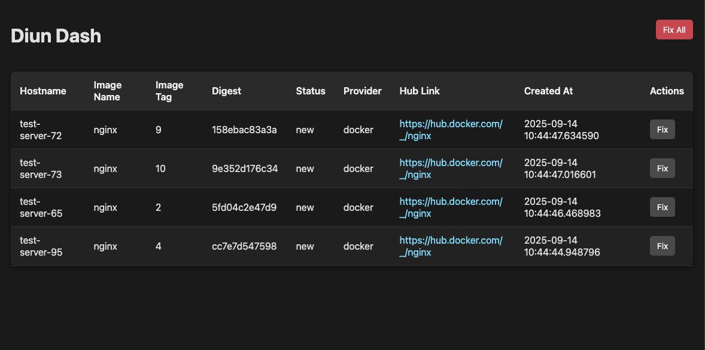

# Diun Dashboard

A web-based dashboard to visualize and manage Docker image update notifications from [Diun](https://crazymax.dev/diun/).



## Why Use Diun Dashboard?

I started using [Diun](https://crazymax.dev/diun/) but didn't like that it just sends notifications to chat clients (Discord, Slack, etc.). Those notifications can get annoying since you don't always have time to fix issues as they appear. I wanted a dashboard I could check periodically and update what's needed on my own schedule.

**This app works best when you pin specific versions of your Docker containers.** If you just use `latest` tags, there are better tools like [Watchtower](https://github.com/containrrr/watchtower) that automatically pull the latest images.

### Intended Workflow

1. **Diun runs periodically** (e.g., daily) and finds outdated images
2. **Diun sends notifications** to Diun Dashboard via webhook
3. **You check the dashboard weekly/monthly** to see what needs updating
4. **You manually update images** on your servers, bumping versions to what the dashboard shows
5. **You press "Fix"** on each notification to remove it from the dashboard

### How It Behaves

- **One notification per image per server**: Only the newest version notification is displayed. If there's already a notification for an older version, a newer version replaces it.
- **Independent state**: Diun and Diun Dashboard use separate databases. If you delete a notification from the dashboard and run Diun again, Diun won't re-send that notification because it thinks it already notified you.

## Features

*   **Clean Web Interface** - View Docker image updates in a modern, dark-themed dashboard
*   **Multi-server Support** - Track images independently across different servers
*   **Individual & Bulk Actions** - Mark single updates as fixed or clear all with "Fix All" button
*   **Persistent Storage** - SQLite database keeps track of all notifications
*   **Easy Setup** - One-command Docker Compose deployment
*   **Secure Webhooks** - Token-based authentication for webhook endpoints

## Getting Started

### Prerequisites

Before you begin, ensure you have the following installed:

#### For Docker deployment:
*   [Docker](https://docs.docker.com/get-docker/)
*   [Docker Compose](https://docs.docker.com/compose/install/)

#### For local development:
*   Python 3.13+
*   [uv](https://docs.astral.sh/uv/) package manager

### Installation

#### Option 1: Docker Deployment (Recommended)

1.  Clone this repository:

    ```bash
    git clone https://github.com/your-repo/diun-dash.git
    cd diun-dash
    ```

2.  Copy the example environment file and configure your webhook token:

    ```bash
    cp .env.example .env
    ```
    
    Edit `.env` and set a secure webhook token:
    ```bash
    DIUN_WEBHOOK_TOKEN=your_secret_token_here
    DATA_PATH=./data
    ```

3.  Start the application using Docker Compose:

    ```bash
    docker-compose up -d
    ```

#### Option 2: Local Development Setup

1.  Clone this repository:

    ```bash
    git clone https://github.com/your-repo/diun-dash.git
    cd diun-dash
    ```

2.  Install dependencies with uv:

    ```bash
    uv sync
    ```

3.  Run database migrations:

    ```bash
    ./scripts/migrate.sh
    ```

4.  Start the development server:

    ```bash
    ./scripts/dev.sh
    ```

## Configuring Diun to Send Notifications

**Important:** For diun-dash to receive notifications about image updates, you need to configure Diun to send webhook notifications to your dashboard.

Add this configuration to your Diun config file:

```yaml
notif:
  webhook:
    endpoint: http://YOUR_DIUN_DASH_HOST:8554/webhook
    method: POST
    headers:
      content-type: application/json
      authorization: your-secret-token
    timeout: 10s
```

**Key Configuration Points:**

- **`endpoint`**: Must match where you run your diun-dash.
- **`authorization`**: Must exactly match the `DIUN_WEBHOOK_TOKEN` value you set in your `.env` file

For additional information, see the [Diun webhook documentation](https://crazymax.dev/diun/notif/webhook/).

## Accessing the Dashboard

Once the services are up and running, you can access the Diun Dashboard in your web browser at:

```
http://localhost:8554
```

## Development Scripts

The project includes convenient scripts for common development tasks:

*   `./scripts/dev.sh` - Start the development server with auto-reload
*   `./scripts/test.sh` - Run the test suite with pytest
*   `./scripts/migrate.sh` - Run database migrations
*   `./scripts/send-test-notification.sh` - Send test webhook notifications for development

## Project Structure

```
diun-dash/
├── src/                    # Source code directory
│   ├── main.py            # Main FastAPI application
│   ├── database.py        # Database connection and operations
│   ├── models.py          # Pydantic models for validation
│   └── templates/         # Jinja2 templates
│       └── index.html     # Main dashboard template
├── tests/                  # Test suite
│   ├── conftest.py        # Test fixtures and configuration
│   ├── test_*.py          # Individual test modules
│   └── ...               # 54+ comprehensive tests
├── alembic/               # Database migrations
├── scripts/               # Development convenience scripts
│   ├── dev.sh            # Development server
│   ├── test.sh           # Test runner
│   ├── migrate.sh        # Database migrations
│   └── send-test-notification.sh  # Send test webhooks
├── pyproject.toml         # Python project configuration
├── uv.lock               # Locked dependencies
└── Dockerfile            # Container build configuration
```

## Development

### Running Tests

The project includes a comprehensive test suite with 54+ tests covering:
- API input validation (Pydantic models)
- Database operations and transactions
- Authentication and authorization
- Multi-server webhook scenarios
- Complete HTTP workflow testing
- Dashboard UI functionality

```bash
./scripts/test.sh
```

Or run tests directly with pytest:
```bash
uv run pytest -v
```

### Testing Webhooks During Development

For development and testing purposes, you can send test webhook notifications using the included script:

```bash
# Send a random test notification
./scripts/send-test-notification.sh

# Test specific server and image
./scripts/send-test-notification.sh --server prod-web --image nginx:alpine

# Test multi-server scenarios
./scripts/send-test-notification.sh --server server-1 --image postgres:13
./scripts/send-test-notification.sh --server server-2 --image postgres:13

# Different status and provider
./scripts/send-test-notification.sh --status updated --provider kubernetes

# See all options
./scripts/send-test-notification.sh --help
```

This script generates realistic DIUN webhook payloads and is perfect for:
- Testing the multi-server functionality
- Verifying webhook authentication
- Populating the dashboard with test data
- Debugging during development

### Database Migrations

To create a new migration:

```bash
uv run alembic revision --autogenerate -m "Description of changes"
```

To apply migrations:

```bash
./scripts/migrate.sh
```

### Multi-Server Support

This dashboard supports tracking Docker images across multiple servers independently. Each server can have the same image with different versions/digests:

- `server-1` with `nginx:alpine` (digest: abc123)
- `server-2` with `nginx:alpine` (digest: def456) 
- `server-3` with `nginx:latest` (digest: ghi789)

All three will be tracked separately, allowing you to see which servers have which versions of your images.

### Technology Stack

*   **Backend**: FastAPI with Python 3.13+
*   **Database**: SQLite with SQLAlchemy ORM
*   **Migrations**: Alembic
*   **Package Management**: uv
*   **Templates**: Jinja2
*   **Testing**: pytest
*   **Containerization**: Docker & Docker Compose

## TODOs
- Github action to build and push the image to docker hub.
- Auth is currently only implemented on the webhook endpoint because Diun uses it by default. Do we also want it on other endpoints?